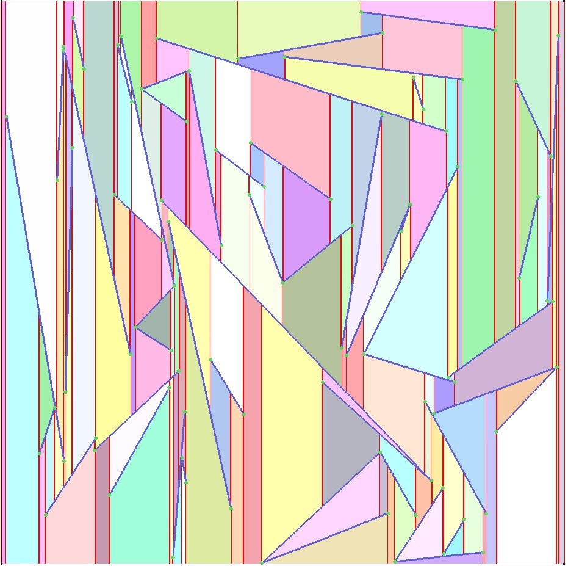
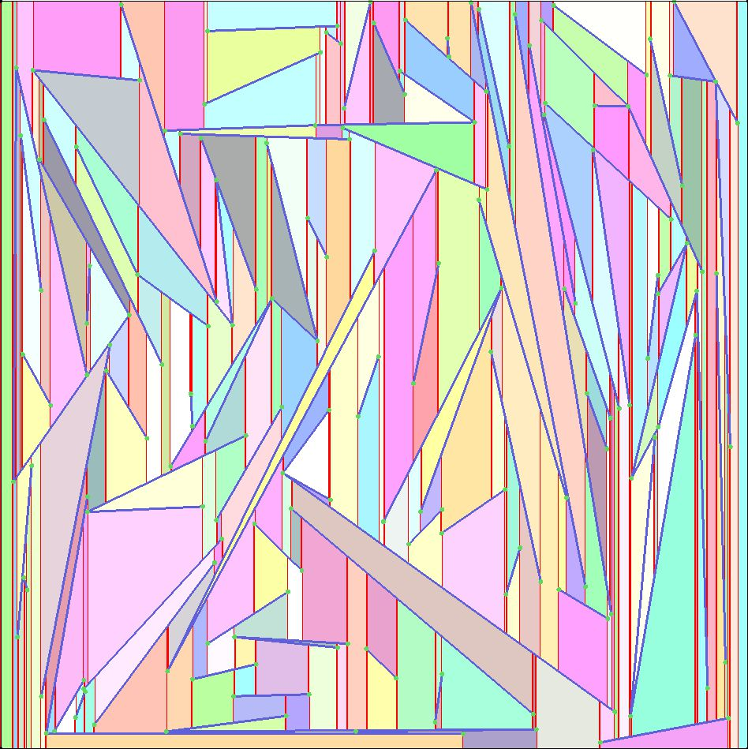
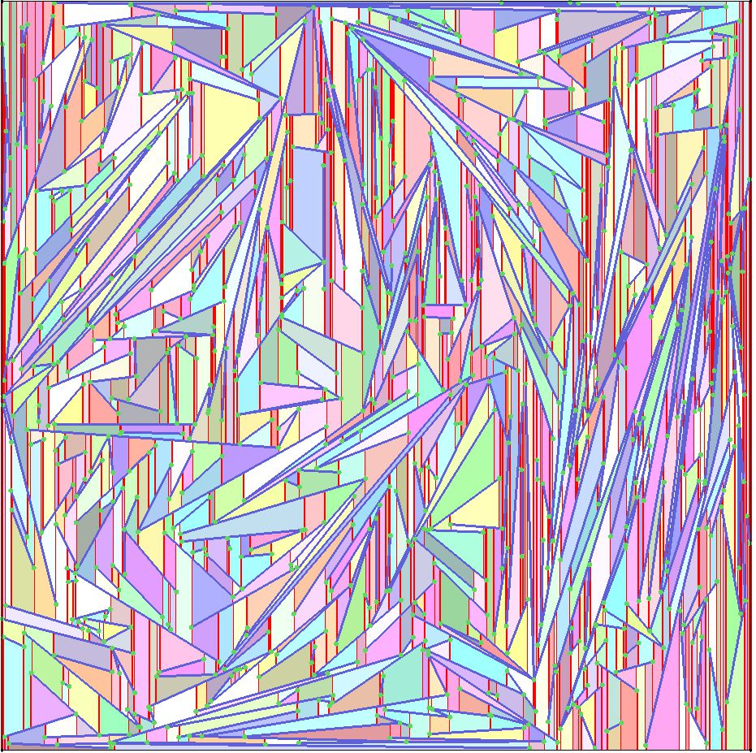
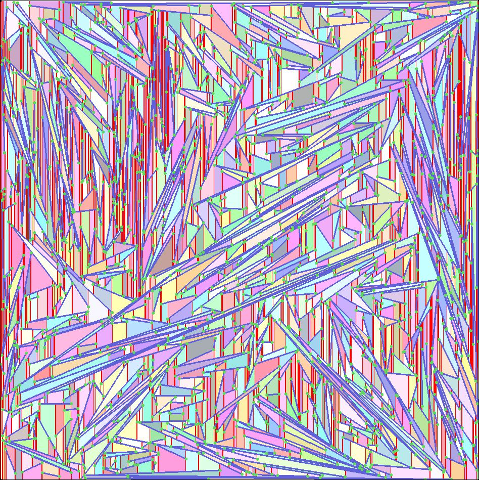
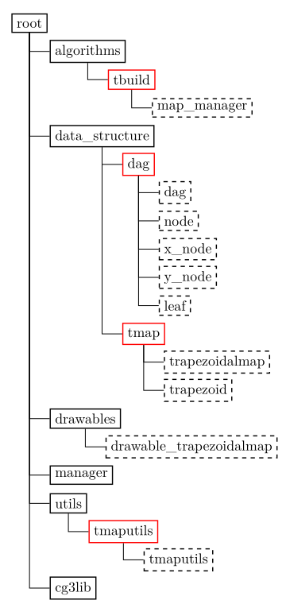

# Trapezoidal Map

- [Overview](#-overview)
- [Features](#-features)
- [Trapezoidal Map Problem](#-trapezoidal-map-problem)
  - [What it solves in practice](#-what-it-solves-in-practice)
  - [Why is it difficult?](#-why-is-it-difficult)
  - [Computational Solution in the Code](#computational-solution-in-the-code)
  - [Point Location Using a Data Structure](#-point-location-using-a-data-structure)
    - [DAG Structure](#dag-structure)
    - [Querying the DAG](#querying-the-dag)
    - [Why use a DAG?](#why-use-a-dag)
- [Getting Started](#-getting-started)
  - [Prerequisites](#prerequisites)
  - [Running the Application](#running-the-application)
- [Usage](#-usage)
- [Project Structure](#-project-structure)
  - [Root Files](#root-files)
  - [Key Directories](#key-directories)
- [Performance & Results](#%EF%B8%8F-performance--results)
- [License](#-license)

| | | |
|:-------------------------:|:-------------------------:|:-------------------------:|
| |     |
|     |     |


## 🔍 Overview

This is a computational geometry project that implements algorithms for constructing and querying trapezoidal maps. Trapezoidal maps are a fundamental data structure used in computational geometry for planar subdivisions and point location problems. This project provides an interactive GUI to visualize and interact with them. The GUI is rendered thanks to the [cg3lib](https://github.com/cg3hci/cg3lib).

## ✨ Features

- **Incremental Construction**: Dynamically add line segments to the trapezoidal map.
- **Point Location Queries**: Efficiently locate a point within the trapezoidal map.
- **Visualization**: Interactive GUI to visualize the trapezoidal map and its updates.
- **Performance Metrics**: Measure the time taken for map construction, segment addition, and point queries.
- **Randomized Segment Generation**: Generate random non-intersecting segments for testing.

## 🌍 Trapezoidal Map Problem

A trapezoidal map is a vertical decomposition of the plane based on the segments in $S$. It is constructed by using vertical rays upward and downward from every segment endpoint, until they hit another segment or a bounding box.

These rays divide the plane into trapezoids—each bounded by up to two segments (top and bottom) and two vertical edges (left and right). The result is a subdivision of the plane into simple, non-overlapping regions.

This data structure is widely used in computational geometry for tasks such **Point Location**. Given a planar subdivision (like a map with regions, or a partitioned polygon), and a query point $q$, determine which region or face contains $q$.

### 🧩 What it solves in practice

A classic real-world example is GPS mapping: given the borders of countries or states (represented as polygonal subdivisions), identify which country/state a given point belongs to.

### ❗ Why is it difficult?
1. The insertion of line segments can significantly alter the structure of the map, requiring efficient updates.
2. Handling edge cases such as overlapping endpoints, vertical segments, and degenerate configurations.
3. Constructing the map and performing queries must be done in optimal time to handle large datasets.

### Computational Solution in the Code

The project solves the trapezoidal map problem using:

1. **Incremental Construction**: Line segments are added one at a time, dynamically updating the map.
2. **Search Structure**: A Directed Acyclic Graph (DAG) is used to represent the trapezoidal map, enabling efficient point location and updates.
3. **Randomized Algorithm**: A randomized incremental algorithm ensures expected $O(n log n)$ construction time, where $n$ is the number of segments.

### 🎯 Point Location Using a Data Structure

To perform point location efficiently, we construct a search structure: a DAG that maps any query point $q$ to the trapezoid containing it.

A DAG is a type of graph that is directed and contains no cycles. In the context of the point location problem, a DAG is used to structure the data to answer vertical ray-shooting queries. The nodes of the DAG represent decision points during the search process, while the edges between the nodes represent decisions leading to further subproblems.

The DAG for point location is built incrementally as segments are added to the trapezoidal map. It allows for an efficient search path that helps identify the correct trapezoid for a given query point. The structure has two types of internal nodes:

1) **x-nodes**: Each x-node represents an endpoint of a segment and contains information about its location in the x-coordinate. The child nodes represent the trapezoids to the left and right of the vertical line passing through this point.

2) **y-nodes**: Each y-node corresponds to a line segment and its children represent whether the query point is above or below the segment.

#### DAG Structure

- Leaves of the DAG correspond one-to-one with trapezoids.
- Internal nodes help guide the query:
   - x-nodes test the x-coordinate of q against a point (segment endpoint).
   - y-nodes test whether q lies above or below a specific segment.
- Each internal node has exactly two children.

#### Querying the DAG

To locate a point $q$, start from the root and:
- Follow left or right at each x-node, depending on whether $q.x < p.x$ (for some point $p$).
- At a y-node, follow left or right based on whether q is above or below a segment.
- This traversal ends at a unique leaf, identifying the trapezoid containing $q$.

#### Why use a DAG?

The DAG structure allows subtree sharing across different paths, which dramatically reduces redundant storage compared compared to a plain binary tree. It also enables local updates during incremental construction without duplicating large parts of the structure.


## 🚀 Getting Started

### Prerequisites

- A C++ compiler supporting C++17 or later.
- CMake for building the project.
- Qt for GUI support.

### Running the Application

After building, you can run the executable to test the trapezoidal map implementation:
```bash
./trapezoidal_map
```

## 🖱️ Usage

1. **Add Segments**: Use the GUI to add line segments to the trapezoidal map.
2. **Query Points**: Click on the canvas to locate a point within the map.
3. **Generate Random Segments**: Use the random segment generation feature to test the algorithm.
4. **Save/Load Segments**: Save the current set of segments to a file or load segments from a file.

## 📁 Project Structure
<p align="center">
  
</p>

- Red boxes = folders with namespaces
- Dotted boxes = C++ source and header files

### Root Files
- **`main.cpp`**: The entry point of the application. Initializes the GUI and manages the main event loop.
- **`GAS_2020_TrapezoidalMaps.pro`**: The Qt project file that defines the build configuration and dependencies.

### Key Directories
#### 🔹`algorithms`
Contains the core computational geometry algorithms used in the project.
- **`tbuild/`**: This namespace contains the core logic to build the trapezoidal map and update the DAG incrementally.

Two main cases for segment insertion:

   - Segment lies entirely within a trapezoid.
   - Segment spans multiple trapezoids.

#### 🔹`data_structures`
Implements the data structures required for trapezoidal map construction and querying.
- **`dag`**: The DAG supports efficient query operations ($O(log n)$ expected) for vertical ray-shooting.
  - `dag::DAG` class contains:
      - A method to find the trapezoid containing a point
      - A method to update DAG structure during insertion
     - `dag::node` is the base class for all types and includes:
        - Node types:
            - x_node: queries x-position of the point vs. a segment endpoint
            - y_node: determines if the point lies above or below a segment
            - leaf:  terminal nodes pointing to trapezoids
         - Left and right children
         - A set of parents, allowing efficient updates and shared subtrees
- **`tmap`**: Implements the trapezoidal map data structure.
   - `trapezoidalmap`:
      - Holds the list of trapezoids
      - Maintains all segment and point data (inspired by dataset structure)

   - `trapezoid`:
      - Stores its top/bottom segments, left/right x-coordinates, and neighbor trapezoids
#### 🔹`drawables`
Contains classes for rendering geometric objects in the GUI.

#### 🔹 `managers`
Manages the high-level operations of the trapezoidal map, including GUI interactions and algorithm execution.

#### 🔹 `utils`
Utility functions and helpers used throughout the project.
- **`tmaputils`**:
   - Geometric calculations (e.g. point reordering, intersections)
   -  Color generation for visualization

## ⏱️ Performance & Results

- **Query time**: `1e-06` to `7e-06` seconds
- **Build time**: scales with `O(n log n)`

### 📊 Build Times (random segments)

| Segments | Build Time (s) |
|----------|----------------|
| 10       | 0.000045       |
| 1000     | 0.003773       |
| 5000     | 0.018759       |
| 10000    | 0.055448       |
| 20000    | 0.115912       |


## 📜 License

This project is licensed under the GNU General Public License v3. See the `LICENSE` file for details.
